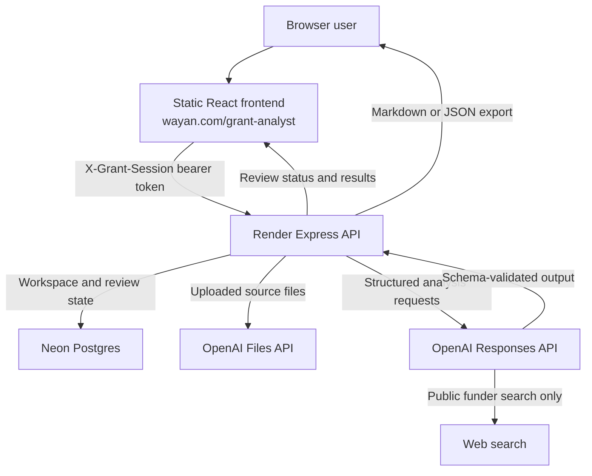

# Grant Analyst Trust Baseline

**Audit date:** July 24, 2026  
**Repository commit audited:** `a2565f8364a4c9c536126ee5b71bbbc3c4ea9778`  
**Production backend commit observed:** `a2565f8364a4c9c536126ee5b71bbbc3c4ea9778`  
**Assessment basis:** Repository inspection, local tests, production smoke tests, live asset comparison, Render deployment status, and read-only Neon schema inventory  
**Governing specification:** `GRANT_ANALYST_IMPROVEMENT_PLAN.md`

## Executive judgment

Grant Analyst is a functioning public demonstration with a sound product thesis, useful structured outputs, basic ownership controls, current funder research, visible progress, versioned reviews, and a tested two-layer OpenAI workflow. It is not ready to inform consequential go or no-go decisions under the trust standard in the improvement plan.

The weakest joint is the evidence chain. A user cannot reliably move from a decision-changing finding to an exact proposal passage, confirmed fact, external passage, deterministic calculation, and reproducible module result. Findings and sources are stored, but their relationships are loose strings generated by the same model that makes the decision. The current citation audit is part of that model output rather than an independent verification stage.

The second major weakness is fact correction. The interface allows users to correct facts after a review, but corrected facts are not supplied to the next analysis pipeline. The correction is stored and the workspace is marked for rerun, yet the next review reads the workspace fields and uploaded documents again. This means the current correction feature creates a stronger impression of control than the execution path supports.

The third major weakness is deterministic analysis. Spreadsheet and CSV files are accepted, but no code parses formulas, recalculates totals, detects hidden sheets, or reconciles budget values. Budget conclusions remain model-generated.

The strongest existing foundation is operational separation. The static frontend contains no privileged credentials. Render owns API access and orchestration, Neon stores application state, and OpenAI receives uploaded files and produces schema-validated outputs. Ownership checks, rate limits, CORS controls, prompt-injection instructions, limited search inputs, cached public research, explicit timeouts, and visible partial-result warnings reduce some public-demo risks.

The smallest safe next build should strengthen trust instrumentation and fact confirmation without replacing the current architecture. Evidence graphs, deterministic budget analysis, modular reruns, authentication, and expert benchmarks should follow as separate gated changes.

## Audit scope and constraints

This audit followed the plan’s required first task. No architecture was replaced, no production schema was changed, and no deployment was triggered.

The audit did not:

- run another paid OpenAI review
- inspect private proposal content
- add an identity provider
- test backup restoration
- commission expert grant reviewers
- add paid foundation data
- perform an independent penetration test
- claim any benchmark metric that has not been measured

The paid production suite had already passed on the exact audited commit earlier on July 24, 2026. That run created three synthetic reviews, required complete non-partial results within 90 seconds, and deleted the test workspaces afterward. The paid suite was not repeated during this baseline because it would incur additional OpenAI charges without testing a changed analysis implementation.

## Verified architecture

### Frontend

The frontend is a React and Vite application compiled to static assets for FTP deployment. It creates a random browser session token, sends that token in `X-Grant-Session`, creates and edits workspaces, uploads documents, starts reviews, polls review status, displays results, records fact corrections, exports reviews, and deletes documents or workspaces.

The live frontend asset hashes matched the local production build during this audit:

- JavaScript: `assets/index-CdRG71_s.js`
- CSS: `assets/index-CpbRWtCr.css`

This confirms that the public frontend was not behind the audited repository build.

### Backend

The backend is an Express service deployed to Render. It:

- validates browser ownership
- enforces CORS and request limits
- validates workspace fields
- accepts one uploaded file per request
- uploads source files to OpenAI
- records document metadata in Neon
- creates background review records
- runs the two-layer analysis
- persists findings, claims, sources, and scalar facts
- returns review status and results
- records corrections and audit events
- exports Markdown or JSON
- deletes source files and workspaces

Review processing runs inside the Render web process through `setImmediate`, not through a durable queue. The active-review registry is an in-memory `Set`.

### Database

The read-only Neon inventory confirmed both migrations and eleven application tables:

| Table | Current purpose |
|---|---|
| `workspaces` | Applicant, funder, opportunity, and workspace state |
| `documents` | File metadata, content hash, and OpenAI file ID |
| `reviews` | Versioned review status, configuration, source snapshot, and result JSON |
| `facts` | Workspace-level scalar extracted and corrected values |
| `findings` | Persisted due-diligence findings |
| `claims` | Persisted claim ledger |
| `sources` | Persisted public funder source metadata |
| `corrections` | Fact correction history |
| `audit_events` | Selected user and system actions |
| `funder_research_cache` | Shared 14-day funder research cache |
| `schema_migrations` | Applied migration ledger |

Applied migrations:

- `001_initial.sql`
- `002_funder_research_cache.sql`

The database contained no retained test reviews at the time of inspection. This is consistent with the production tests’ cleanup behavior.

### OpenAI workflow

The backend uploads user documents with the Files API using purpose `user_data`. The analysis uses the Responses API with Zod structured output, `store: false`, a hashed safety identifier, no SDK retries, explicit request timeouts, and output-token limits.

The current two-layer workflow is:

1. Run proposal assessment and funder research in parallel.
2. Run reviewer simulation and adjudication in one combined decision call.

Proposal assessment and final decision use `gpt-5.6-luna`. Public funder research uses `gpt-5.6-terra` with web search.

The web-search call receives only the funder, opportunity, geography, program area, and access date. Uploaded private document text is not inserted into the public search query by the application.

## Verified data flow

### Upload

1. The browser sends a document and its category to Render.
2. Render validates the filename extension and request size.
3. Render holds the upload in memory.
4. Render uploads the file to OpenAI.
5. Render stores document metadata, SHA-256 content hash, and OpenAI file ID in Neon.
6. Render writes an upload audit event.

Neon does not store the raw uploaded file bytes. OpenAI stores the uploaded file until deletion is requested.

### Review

1. The browser requests a full analysis.
2. Render verifies ownership, quota, absence of another running review, and presence of a proposal document.
3. Render inserts a `running` review with model configuration and a document metadata snapshot.
4. Render returns HTTP 202 immediately.
5. The in-process background task runs the two analysis layers.
6. The frontend polls the review record and displays continuous estimated progress.
7. Render persists findings, claims, sources, and scalar fact strings.
8. Render stores the full analysis JSON in the review record.
9. Render marks the review `completed`, even when the embedded pipeline is marked `partial`.

### Correction

1. The user edits one displayed scalar fact.
2. Render updates `facts.confirmed_value`.
3. Render stores a correction record.
4. Render marks the workspace `needs_rerun`.
5. A later full review does not read the corrected facts table.

Step five is a P0 defect under the improvement plan. The correction is preserved for display and audit, but it is not authoritative input to later analysis.

### Export

JSON export contains the workspace, review metadata, and full analysis result. Markdown export contains the final recommendation, scorecard, revision priorities, reviewer summaries, damaging questions, claim ledger, public source links, citation audit, and limitations.

Markdown export does not preserve a complete finding-to-passage evidence chain because the underlying passage graph does not exist.

### Deletion

Deleting a document or workspace requests deletion of associated OpenAI files and deletes the Neon record. OpenAI deletion errors are caught and logged as warnings. The database deletion proceeds even when OpenAI deletion cannot be confirmed. There is no retry queue or deletion-verification record.

## Trust boundaries and sensitive-data flow

### Browser boundary

The browser and static frontend are untrusted. The session token is a bearer secret stored in browser local storage. Anyone with that token can act as the browser owner. Clearing local storage removes the user’s ability to recover access.

### Render boundary

Render holds the OpenAI key, Neon connection string, and session pepper. It is the application’s main access-control boundary.

The current pseudonymous session model provides isolation between random browser tokens. It does not establish identity, organizational membership, named accountability, recovery, multi-factor authentication, or team roles.

### Neon boundary

Neon stores pseudonymous ownership hashes, workspace metadata, derived results, source URLs, correction history, and audit events. The repository does not demonstrate field-level encryption, a retention scheduler, tenant keys, backup restoration, or deletion verification.

### OpenAI boundary

OpenAI receives proposal files and structured analysis requests. `store: false` applies to response storage, but the uploaded files are separately created through the Files API and remain until deletion. The public interface warns users not to submit confidential proposals.

### Web-search boundary

The application restricts public search inputs to non-document workspace fields. This satisfies one important part of the plan’s safe-query requirement. The application does not yet record the generated search queries or retrieved passages as versioned evidence.

## Current schemas and persisted artifacts

### Analysis schemas

The Zod schemas cover:

- extracted workspace facts
- governing funder requirements
- conflicts and missing documents
- funder profile and comparable grants
- source metadata and reliability tier
- due-diligence dimensions
- findings
- claims and evidence status
- penalties and evidence coverage
- specialist reviews
- reviewer personas
- rejection memo
- damaging questions
- failure pre-mortem
- eligibility, merit, fit, readiness, and recommendation
- revision priorities
- citation audit and limitations

Schema validation is a real strength. Model output missing required fields cannot be accepted as a valid stage result.

### Review configuration

Each review records:

- review ID
- workspace ID
- integer version
- status and stage
- model
- analysis and fast model names
- pipeline name
- timeout settings
- cache period
- a document metadata snapshot
- start and completion timestamps
- final result JSON

### Missing manifest fields

The current record is not a complete analysis manifest. It lacks:

- proposal version entity ID
- confirmed-fact snapshot ID
- immutable source snapshot ID
- document content hashes in the review snapshot
- rubric version
- scoring version
- penalty version
- prompt versions or prompt hashes
- module versions
- provider request IDs
- correlation ID
- per-stage result status
- structured error codes
- cost and token use
- source freshness dependencies
- human reviewer or final decision owner

## Representative review trace

The current code path for one review is reproducible at the service level:

1. `POST /api/workspaces` creates the owned workspace and audit event.
2. `POST /api/workspaces/:id/documents` validates the request, uploads the file to OpenAI, stores metadata, and records an audit event.
3. `POST /api/workspaces/:id/analyze` checks quota and inputs, creates the versioned review, stores configuration and source metadata, and returns HTTP 202.
4. `runAnalysisPipeline` marks `analyzing_inputs`.
5. Proposal assessment and cached or current funder research run in parallel.
6. The pipeline marks `making_decision`.
7. Reviewer simulation, rejection case, adjudication, and citation audit run in one model call.
8. `persistAnalysis` writes findings, claims, sources, and scalar facts.
9. The server stores the full result JSON and marks the review completed.
10. The user opens the result or downloads Markdown or JSON.

This trace is reproducible as an application sequence. A single final finding is not reproducible from stored evidence because the database lacks source passages, evidence links, prompt hashes, module versions, and deterministic score calculation.

## Current test and production status

### Local verification

All checks passed on July 24, 2026:

| Check | Result |
|---|---:|
| Frontend TypeScript lint | Pass |
| Backend syntax checks | Pass |
| Backend unit tests | 10 passed |
| Frontend tests | 2 passed |
| Production frontend build | Pass |
| Git diff whitespace check | Pass before report creation |

The backend tests cover:

- cache key normalization
- cache hits
- concurrent cache sharing
- text validation
- stable hashed ownership
- rejection of weak session tokens
- public metadata secrecy
- fallback schema validity
- parallel layer-one orchestration
- marked partial fallback behavior

The frontend tests cover:

- secret separation
- API configuration
- presence of review progress
- FTP build asset paths

### Production verification

The free production suite passed four tests:

- public frontend and static assets
- health, metadata, security headers, and allowed CORS
- session and CORS rejection behavior
- workspace CRUD, isolation, validation, and no-document review guard

The live backend reported:

- review stages: `analyzing_inputs`, `making_decision`
- daily review limit: 20
- browser-session daily review limit: 2
- upload limit: 15 MB

Render reported the exact repository commit as live. GitHub Actions passed on the same commit.

### Paid production test

The repository contains an opt-in production test that requires exactly three synthetic reviews, complete structured output, no partial result, approved model IDs, and a recorded pipeline duration no greater than 90 seconds.

That test passed against the exact audited commit earlier in the build session. It was not rerun for this baseline.

### Coverage gaps

The current suite does not test:

- pre-analysis fact confirmation
- corrected fact influence on a later verdict
- exact evidence passages
- citation entailment
- deterministic budget arithmetic
- hidden sheets or broken formulas
- prompt injection end to end
- stale-result invalidation
- modular reruns
- source removal dependencies
- source freshness refresh
- authentication and named tenant isolation
- role authorization
- malware or file-signature validation
- backup restoration
- deletion retries and verification
- bias by applicant size, geography, or writing polish
- keyboard and screen-reader workflows beyond selected ARIA attributes

## Code evidence index

The main audit conclusions resolve to these implementation points:

| Finding | Code evidence |
|---|---|
| Reviews run as in-process background work | [`backend/src/server.mjs`](../backend/src/server.mjs#L66), [`backend/src/server.mjs`](../backend/src/server.mjs#L295) |
| Review configuration and source metadata are stored before analysis | [`backend/src/server.mjs`](../backend/src/server.mjs#L258) |
| Proposal analysis and funder research run in parallel | [`backend/src/review-pipeline.mjs`](../backend/src/review-pipeline.mjs#L43) |
| Reviewer simulation and adjudication share one model call | [`backend/src/review-pipeline.mjs`](../backend/src/review-pipeline.mjs#L92) |
| Partial state is embedded inside the result | [`backend/src/review-pipeline.mjs`](../backend/src/review-pipeline.mjs#L118) |
| Server review status is set to completed after any returned analysis | [`backend/src/server.mjs`](../backend/src/server.mjs#L78) |
| Model output uses Zod schema validation and explicit time budgets | [`backend/src/openai-client.mjs`](../backend/src/openai-client.mjs#L31) |
| Public search inputs exclude uploaded private document text | [`backend/src/review-pipeline.mjs`](../backend/src/review-pipeline.mjs#L64) |
| Findings and claims persist loose evidence arrays | [`backend/src/persistence.mjs`](../backend/src/persistence.mjs#L18) |
| Only scalar fact values are persisted | [`backend/src/persistence.mjs`](../backend/src/persistence.mjs#L53) |
| Fact corrections update the fact table and mark the workspace for rerun | [`backend/src/server.mjs`](../backend/src/server.mjs#L321) |
| The analysis pipeline receives workspace fields and documents, not confirmed facts | [`backend/src/review-pipeline.mjs`](../backend/src/review-pipeline.mjs#L26) |
| Current finding and claim schemas lack passage entities and evidence relationships | [`backend/src/schemas.mjs`](../backend/src/schemas.mjs#L61) |
| Prompt-injection and missing-evidence rules exist in prompts | [`backend/src/prompts.mjs`](../backend/src/prompts.mjs#L1) |
| File validation uses extension allowlisting | [`backend/src/server.mjs`](../backend/src/server.mjs#L16), [`backend/src/server.mjs`](../backend/src/server.mjs#L200) |
| OpenAI file deletion failure is logged but not retried | [`backend/src/openai-client.mjs`](../backend/src/openai-client.mjs#L19) |
| Database tables lack passages, evidence links, module results, and manifests | [`backend/migrations/001_initial.sql`](../backend/migrations/001_initial.sql), [`backend/migrations/002_funder_research_cache.sql`](../backend/migrations/002_funder_research_cache.sql) |
| The frontend exposes progress and partial warnings | [`frontend/src/App.tsx`](../frontend/src/App.tsx#L353), [`frontend/src/App.tsx`](../frontend/src/App.tsx#L477) |
| Production tests verify isolation, CORS, validation, and live assets | [`tests/live-smoke.test.mjs`](../tests/live-smoke.test.mjs) |
| Paid tests verify three complete synthetic reviews within 90 seconds | [`tests/paid-analysis.test.mjs`](../tests/paid-analysis.test.mjs#L73) |

## Gap matrix

| Workstream | Status | Verified implementation | Main gap |
|---|---|---|---|
| 0. Baseline and trust instrumentation | **Partial** | Review IDs, versions, model configuration, source metadata snapshot, schema validation, timings, warnings, audit events | No complete manifest, prompt hashes, rubric versions, correlation IDs, structured model errors, broad fixture set, or per-stage records |
| 1. Fact confirmation | **Partial, misleading rerun behavior** | Scalar facts table, post-review confirmation UI, correction history | No pre-analysis gate, weak source references, arrays omitted from persistence, correction not supplied to later analysis, no override state, no dependency invalidation |
| 2. Evidence graph and citation integrity | **Mostly absent** | Claim locations, source URLs, evidence strings, model-generated citation audit | No passages, passage hashes, evidence relationships, entailment verifier, source versioning, broken-link audit, or finding-to-highlight interaction |
| 3. Deterministic budget analyzer | **Absent** | Spreadsheet formats accepted, model can discuss budget | No parser, formula inspection, recalculation, currency method, cell provenance, reconciliation, or arithmetic fixtures |
| 4. Modular due diligence | **Absent** | Two pipeline layers, dimensions named in structured output, timeouts, partial warnings | No module contracts, dependency graph, independent reruns, stale states, reconstructible scoring, or module-level costs |
| 5. Foundation Intelligence Brief | **Partial** | Current web research, profile, comparable grants, sources, limitations, opportunity cost, 14-day cache | No passage records, record-level history, reproducible statistics, sample size, trend rules, applicant comparators, or refresh control |
| 6. Evaluation, security, and operations | **Partial** | Unit and smoke tests, paid synthetic timing test, CORS, Helmet, rate limits, pseudonymous isolation, limited search query, timeouts | No expert benchmark, metrics, red-team suite, auth, malware scanning, retention, restore test, durable queue, monitoring, deletion verification, or incident procedure |
| 7. Version comparison | **Mostly absent** | Immutable review versions and full result JSON | No comparison interface, stable cross-version entity IDs, substantive-change detection, or verdict-change explanation |
| 8. Advanced stress tests | **Partial concept only** | Five damaging questions and failure pre-mortem | No oral defense, answer audit, counterfactual module, additionality test, or disclosed portfolio comparison |
| 9. Team collaboration | **Absent** | Pseudonymous single-browser owner | No named users, roles, assignments, comments, sharing, specialist workflow, or human decision attribution |

## Requirement-level findings

### Provenance

**Status: Insufficient.**

Document hashes exist, and claim locations may identify a filename and page or section. Findings store evidence strings. External sources store URLs and metadata.

The system does not store exact proposal passages, exact external passages, passage hashes, cell references, evidence relationships, or source versions. A final finding cannot be traced through a stored graph.

### Entailment

**Status: Unverified.**

The prompts instruct the model to cite evidence and run a citation audit. The final decision call produces both the conclusion and its audit. No independent stage determines whether a passage entails a claim. No benchmark measures citation-entailment precision.

### Reproducibility

**Status: Partial.**

Review JSON, model names, timeouts, cache status, document metadata, and timestamps are stored. Prompt text is in source control.

The record does not pin prompt hashes, rubric and penalty versions, exact source passages, provider request IDs, confirmed-fact snapshot, or module versions. Cached research can change after expiry without an immutable source bundle.

### Correctability

**Status: Fails the intended behavior.**

Corrections are stored, but they do not become inputs to the next analysis. All new reviews rerun the full two-layer pipeline. No module staleness or affected-result preview exists.

### Bounded uncertainty

**Status: Partial.**

Schemas distinguish supported, partially supported, unsupported, contradicted, unverifiable, aspirational, and not-material claims. The prompts warn against treating missing evidence as negative evidence. Confidence and limitations are present.

The database status still marks a review `completed` when `analysis.pipeline.partial` is true. This weakens failure semantics. The frontend displays a partial warning only after the user opens the result.

### Appropriate human control

**Status: Partial.**

Specialist reviews can be listed in the analysis. The product warns that it is an assessment rather than a prediction.

There is no specialist assignment, sign-off, named decision owner, override rationale, or human-owned final go or no-go record.

## Known failure modes

1. **Corrected facts do not control future analysis.** A user may believe a corrected value influenced a rerun when it did not.
2. **Partial reviews are stored as completed.** The embedded result carries a warning, but review status does not distinguish complete from complete with warnings or partial.
3. **Model arithmetic can appear authoritative.** Spreadsheet acceptance may imply calculation checking that the code does not perform.
4. **Citation self-audit is circular.** The model audits the conclusions it just generated.
5. **Evidence strings cannot prove support.** Relevance, entailment, and source version are not independently stored.
6. **Background work is not durable.** A process restart can interrupt reviews. There is no queue, idempotency key, or dead-letter path.
7. **OpenAI deletion can fail silently from the user’s perspective.** The database record can disappear before external-file deletion is confirmed.
8. **Extension checks can be bypassed.** The service checks filename extensions but does not verify file signatures or scan for malware.
9. **Cached research lacks dependency records.** Removing or refreshing a source does not mark dependent conclusions stale.
10. **Scoring is not reconstructible.** The model returns dimensions, penalties, and a final score, but deterministic code does not calculate the score from stored module results.
11. **Workspace metadata can conflict with documents.** The system sends both to the model but does not require user resolution before adjudication.
12. **Audit coverage is selective.** Uploads, corrections, review completion, and deletion are recorded, but model requests, source retrievals, exports, and review reads lack complete correlation.
13. **Serious-team privacy controls are absent.** There is no identity, tenant administration, retention schedule, signed file access, or recovery mechanism.
14. **Public research can become stale within the cache period.** The result contains a research date, but the interface provides no force-refresh action.

## Smallest safe implementation sequence

### Build 1: Trust manifest, failure semantics, and fixtures

This is the recommended first implementation. It strengthens explainability without changing the two-layer product architecture.

Add:

- an immutable analysis manifest
- prompt and rubric hashes
- module identifiers for the two current layers
- provider request IDs where available
- correlation IDs across upload, review, persistence, and export
- explicit `complete`, `complete_with_warnings`, `partial`, and `failed` review states
- structured error codes
- sanitized regression fixtures for conflicts, unsupported claims, prompt injection, and partial failures
- tests proving that a partial pipeline cannot be stored as a clean completion

Likely files:

- `backend/migrations/003_trust_manifest.sql`
- `backend/src/analysis-manifest.mjs`
- `backend/src/errors.mjs`
- `backend/src/openai-client.mjs`
- `backend/src/review-pipeline.mjs`
- `backend/src/server.mjs`
- `backend/src/persistence.mjs`
- `backend/tests/fixtures/`
- `backend/tests/analysis-manifest.test.mjs`
- `backend/tests/failure-semantics.test.mjs`
- `tests/live-smoke.test.mjs`

### Build 2: Pre-analysis fact extraction and confirmation gate

Separate fact extraction from the full review. Persist decision-critical facts with exact proposal locations, conflicts, status, confirmation actor, and snapshot ID. Block the full review until every required fact is confirmed, corrected, marked unknown, or explicitly overridden.

Pass the immutable confirmed-fact snapshot into every dependent analysis. Add a test proving that correcting the requested amount changes the actual next-run input.

Likely files:

- `backend/migrations/004_fact_confirmation.sql`
- `backend/src/fact-extraction.mjs`
- `backend/src/fact-dependencies.mjs`
- `backend/src/schemas.mjs`
- `backend/src/server.mjs`
- `backend/src/review-pipeline.mjs`
- `frontend/src/App.tsx`
- `frontend/src/types.ts`
- new backend and frontend tests

### Build 3: Evidence passages and finding links

Add source versions, passage records, proposal passages, evidence links, and finding-to-evidence endpoints. Preserve exact text, locations, hashes, relationship type, strength, temporal relevance, and inference status.

Do not begin with a complex visual graph. Start with normalized tables and an inspectable finding evidence panel.

### Build 4: Independent citation audit

Run citation validation after adjudication as a separate module. Begin with deterministic checks for missing links, wrong source versions, broken URLs, missing proposal locations, and new uncited final facts. Add a separately prompted entailment check only where deterministic checks cannot decide support.

### Build 5: Deterministic budget engine

Implement CSV and XLSX parsing, formula inspection, totals, duplicates, unit calculations, indirect-cost checks, mixed-currency warnings, and exact fixtures before adding broader document-table extraction.

### Build 6: Dependency graph and modular reruns

Convert the current two broad layers into versioned module contracts. Preserve the fast user experience by running independent modules concurrently and rerunning only stale descendants.

### Build 7: Foundation intelligence, evaluation, and production controls

Deepen funder records, add reproducible statistics, build the expert benchmark, run red-team suites, and implement authenticated tenant controls before representing the product as suitable for private consequential work.

## Decisions requiring owner approval

The baseline identifies six choices that should be settled before their related build begins.

1. **Product representation:** Keep the public version explicitly labeled as a demonstration until P0 evidence, benchmark, identity, and security gates pass.
2. **Authentication:** Choose an identity provider and define whether organizations, individual consultants, or both are the tenant boundary.
3. **Retention:** Define retention periods for uploaded OpenAI files, Neon workspaces, exports, logs, backups, and deleted records.
4. **Modular analysis cost:** Approve the likely increase in model calls from independent modules, balanced against cache reuse and bounded reruns.
5. **Budget parsing scope:** Decide whether the first deterministic engine supports XLSX and CSV only or also attempts PDF and DOCX table extraction.
6. **Expert benchmark:** Approve reviewer recruitment, permissions, compensation if any, proposal sourcing, and publication of failure results.

No approval is needed to implement Build 1 locally. The improvement plan does require approval before applying a production migration or deploying the resulting backend.

## Baseline release gate

The baseline is complete when the owner accepts these three conclusions:

1. Grant Analyst should remain a public demonstration and should not be represented as ready for consequential decisions.
2. Trust manifest and failure semantics should precede new analytical features.
3. Pre-analysis fact confirmation must follow immediately because the current correction path does not affect later model input.

Once those conclusions are accepted, Build 1 is the smallest safe implementation step.
